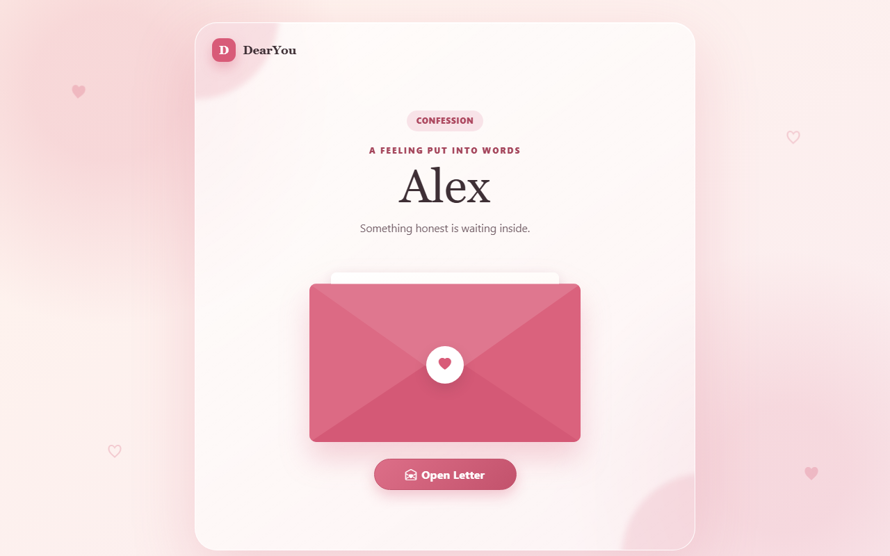
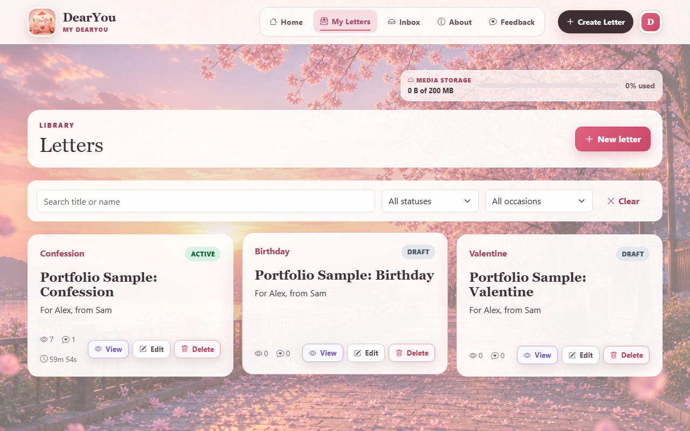
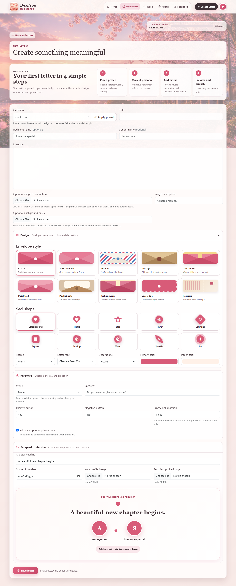

# DearYou

DearYou is a responsive private-letter platform for creating meaningful digital letters. It helps people write styled letters, attach media and memories, publish expiring private links, collect recipient reactions or replies, and save an offline keepsake copy from one focused website.

**Live demo:** [https://dearyous.app](https://dearyous.app)

## Overview

DearYou has three main areas:

- **Public side:** homepage, feedback form, authentication pages, and private recipient links.
- **Creator side:** protected workspace for writing letters, managing drafts, publishing links, tracking opens, and reading responses.
- **Admin side:** protected platform dashboard for managing users, settings, feedback, moderation, storage limits, expiry options, audit logs, email tools, and deployment health.

### Who uses it

| Role | Access |
|------|--------|
| **Guest** | Browse the homepage, submit feedback, and open valid private letter links |
| **Creator** | Register, verify email, create letters, upload media, publish links, and manage responses |
| **Admin** | Manage platform settings, users, moderation, feedback, audit logs, storage policy, and health tools |

## Screenshots

<p align="center">
  
</p>
<p align="center"><sub><strong>Homepage</strong> - landing page and product overview</sub></p>

<p align="center">
  
</p>
<p align="center"><sub><strong>Public letter</strong> - styled recipient experience on a private link</sub></p>

<p align="center">
  
  <br /><br />
  
</p>
<p align="center"><sub><strong>Creator workspace</strong> - manage drafts and build themed letters</sub></p>

## Technology Stack

| Layer | Tools |
|-------|-------|
| Backend | Laravel 13, PHP 8.4 |
| Database | MySQL in production, SQLite-friendly tests |
| Frontend | Blade, HTML, CSS, Bootstrap 5, Bootstrap Icons, JavaScript |
| Build | Vite, Tailwind CSS 4 |
| Auth | Laravel sessions, email verification codes, password reset codes, Laravel Sanctum API tokens |
| Email | Resend in production |
| Queue | Laravel queue worker |
| Storage | Laravel filesystem storage, public storage link, upload limits, cleanup logs |
| Testing | PHPUnit feature tests, Laravel Pint |
| Deployment | DigitalOcean, Nginx, PHP-FPM 8.4, systemd worker/scheduler, Certbot |

## Project Structure

DearYou keeps the standard Laravel folder layout so Artisan, Composer, Vite, tests, and deployment tools work normally.

### Frontend

User-facing UI, Blade pages, styling, static assets, and portfolio screenshots.

- `resources/views/` - Blade templates for public pages, auth pages, creator workspace, admin panel, and partials
- `public/assets/dearyou/` - custom CSS, JavaScript, and DearYou brand images
- `public/vendor/` - tracked Bootstrap and Bootstrap Icons assets served by the app
- `screenshots/` - portfolio screenshots used in this README
- `scripts/capture-portfolio-screenshots.mjs` - screenshot automation for README images

### Backend

Application logic, routes, controllers, models, middleware, and support services.

- `app/Http/Controllers/` - public, creator, admin, and API controllers
- `app/Http/Middleware/` - active-account, role, admin-network, and canonical-host middleware
- `app/Models/` - Eloquent models for users, letters, links, memories, responses, feedback, settings, metrics, and audits
- `app/Support/` - business logic for publishing, storage allowances, settings, account deletion, routes, and security-code logging
- `app/Notifications/` - email notifications for verification, password reset, feedback, and storage events
- `routes/web.php` - browser routes
- `routes/api.php` - Sanctum-protected API routes
- `routes/console.php` - scheduled commands and cleanup tasks
- `config/` - Laravel and application configuration

### Database

Schema, seed data, factories, and database-backed application state.

- `database/migrations/` - table definitions for users, letters, links, media, responses, feedback, settings, metrics, audits, and jobs
- `database/seeders/` - initial admin/settings/demo seed logic
- `database/factories/` - test data factories
- MySQL - production relational database
- Laravel queue tables - queued email and background work

### Authentication & Authorization

Login, registration, verification, password reset, roles, active-account checks, and API tokens.

- Email verification by expiring code
- Password reset by expiring email code
- Role-based access for `user` and `admin`
- Active-account middleware blocks disabled users and existing sessions
- Admin network allowlist support
- Sanctum API tokens for authenticated creator API endpoints

### Storage & Media

Uploaded files, public storage links, keepsake media, and storage policy.

- Letter media supports images, GIFs, MP4, and Telegram WebM-style uploads
- Memories can include multiple media items with ordering
- Music/audio can be attached to letters
- Storage usage is counted across creator media sources
- Configurable storage limits, warnings, grace periods, and cleanup logs
- Keepsake downloads embed image, GIF, or video media directly into the saved HTML

### API & Integrations

External-facing API docs and service integrations.

- `postman/` - Postman API collection
- Resend - production transactional email
- Laravel Sanctum - API authentication
- Google Search Console - canonical non-www domain verified for indexing

### Testing & Quality

Automated tests and project validation.

- `tests/Feature/DearYouFlowTest.php` - main end-to-end feature coverage
- `php artisan test` - Laravel/PHPUnit test runner
- `vendor/bin/pint --test` - Laravel code style check
- `composer audit` - PHP dependency advisory check
- `npm audit --omit=dev` - frontend production dependency check
- `npm run build` - production asset build

### Deployment

Production hosting, environment setup, and server responsibilities.

- DigitalOcean Ubuntu server
- Nginx web server
- PHP-FPM 8.4
- MySQL database
- systemd queue worker and scheduler
- Certbot SSL certificate
- Name.com DNS
- `deploy/` - Nginx, worker, scheduler, upload, backup, and deploy files
- `.env.example` - local environment template
- `.env.production.example` - production environment template without secrets
- `composer.json` - PHP dependencies and deployment scripts
- `package.json` - frontend build scripts

### Portfolio Tools

Files used only to present the project professionally.

- `screenshots/` - GitHub README screenshots
- `scripts/capture-portfolio-screenshots.mjs` - four-image README capture script
- `scripts/capture-screenshots.mjs` - broader full-site capture script for review
- `scripts/prepare-screenshot-data.php` - local demo data preparation
- `scripts/screenshot-config.json` - generated local-only screenshot credentials, ignored by Git

## Architecture

```text
Browser / API client
        |
        v
Laravel routes (web + api)
        |
        +-- Controllers (public, creator, admin, Api/)
        +-- Middleware (auth, active, verified, role, canonical host, admin network)
        +-- Support services (publishing, storage limits, settings, account deletion)
        |
        v
Eloquent models -> MySQL
        |
        +-- Queue worker (email and background jobs)
        +-- Scheduler (cleanup and maintenance)
        +-- Storage (letter media, memories, audio, avatars)
```

Business logic lives in support classes where it would otherwise make controllers too busy. Authorization is enforced through middleware, route groups, and controller checks. Email verification and password reset use hashed, expiring one-time codes.

## Main Features

- Public homepage with product overview, FAQs, occasions, and private feedback form
- User registration, login, logout, email verification, and password reset by code
- Creator dashboard for draft and published letters
- Letter builder with category, title, body, recipient/sender names, themes, fonts, envelopes, seals, colors, and decorations
- Media support for letter images, GIFs, videos, audio/music, profile images, and memory galleries
- Private expiring share links with regenerate, disable, unpublish, and open-count tracking
- Recipient page with reactions, optional private messages, thank-you states, and response privacy
- Keepsake HTML downloads with embedded media for offline viewing
- Creator inbox with response filters, unread state, bulk actions, and deletion
- Account settings with profile picture, password update, API token controls, and account deletion
- Admin user management with roles, status, verification tools, soft delete, restore, and permanent delete
- Platform settings for categories, storage limits, expiry windows, feedback email, and feature controls
- Feedback inbox for reviewing, resolving, and deleting visitor feedback
- Moderation tools for revealing content with audit reasons, disabling public links, restoring letters, and overriding expiry
- Audit logs for sensitive moderation and platform actions
- Deployment health and email queue tools
- Canonical host redirect from `www.dearyous.app` to `dearyous.app` for search indexing

## Local Setup

### Prerequisites

- PHP 8.4+
- Composer
- Node.js 18+ and npm
- MySQL 8+ or SQLite for local testing

### Install

**Windows (PowerShell):**

```powershell
composer install
npm install
Copy-Item .env.example .env
php artisan key:generate
php artisan storage:link
```

**macOS / Linux:**

```bash
composer install
npm install
cp .env.example .env
php artisan key:generate
php artisan storage:link
```

Set local admin credentials in `.env`:

```env
ADMIN_EMAIL=admin@dearyou.test
ADMIN_PASSWORD=your-local-admin-password
```

Run migrations, seed data, build assets, and start the app:

```bash
php artisan migrate --seed
npm run build
php artisan serve --port=8001
```

Open [http://127.0.0.1:8001](http://127.0.0.1:8001).

Useful local routes:

- `/` - public homepage
- `/register` - creator signup
- `/login` - creator sign-in
- `/letters` - creator letters
- `/inbox` - creator responses
- `/admin/login` - platform admin login

For local email testing, use the log mailer:

```env
MAIL_MAILER=log
```

If queued email is enabled locally, keep a worker running in another terminal:

```bash
php artisan queue:work
```

## Quality Checks

Run before publishing repo changes:

```bash
php artisan test                  # PHPUnit feature test suite
vendor/bin/pint --test            # Laravel code style
composer audit                    # PHP dependency security audit
npm audit --omit=dev              # JavaScript production dependency audit
npm run build                     # Production asset build
```

Current project status:

- Test suite: 94 tests, 800 assertions
- Laravel Pint: passing
- Composer audit: no advisories
- npm production audit: no vulnerabilities
- Vite production build: passing

## Portfolio Screenshots

To regenerate the four README screenshots locally:

```bash
php artisan serve --port=8001
php scripts/prepare-screenshot-data.php
node scripts/capture-portfolio-screenshots.mjs
```

The capture script saves fixed-viewport images (`1280x800`) into `screenshots/` for a consistent GitHub layout.

`scripts/screenshot-config.json` is generated locally and ignored because it contains temporary login details for screenshot automation.

## Admin Access

This project does not store a real administrator password in source code.

Set local admin credentials in `.env`, then seed the database:

```env
ADMIN_EMAIL=admin@dearyou.test
ADMIN_PASSWORD=your-local-admin-password
```

```bash
php artisan migrate --seed
```

Admin URL: [http://127.0.0.1:8001/admin/login](http://127.0.0.1:8001/admin/login)

Public registration always creates normal creator accounts. Administrator access is protected by role checks and optional network allowlisting.

## Email Setup

DearYou uses Resend for production email. Email is used for verification codes, password reset codes, feedback notifications, and storage warning messages.

Example production mail configuration (set values in `.env` only - never commit them):

```env
MAIL_MAILER=resend
RESEND_API_KEY=your-resend-api-key
MAIL_FROM_ADDRESS=hello@dearyous.app
MAIL_FROM_NAME="${APP_NAME}"
QUEUE_CONNECTION=database
```

Because emails are queued, production should run a queue worker:

```bash
php artisan queue:work --tries=3
```

## API Support

DearYou includes Sanctum-protected API routes for authenticated creators.

Main API capabilities:

- List, create, view, update, and delete letters
- Publish and unpublish letters
- List recipient responses

Import the Postman collection:

```text
postman/DearYou.postman_collection.json
```

Before running requests, fill the collection variables locally:

- `base_url`
- `email`
- `password`
- `token`
- letter IDs or published link data created in your local database

The collection does not include real login credentials.

## Production Checklist

- Set `APP_ENV=production` and `APP_DEBUG=false`
- Set `APP_URL=https://dearyous.app`
- Generate a fresh production `APP_KEY`
- Use a dedicated production MySQL database user and password
- Configure Resend through environment variables only
- Run `php artisan migrate --force`, `php artisan storage:link`, and `php artisan optimize`
- Run the Laravel queue worker and scheduler
- Configure upload limits for Nginx and PHP
- Serve through Nginx and PHP-FPM 8.4 with HTTPS
- Redirect `www.dearyous.app` to `dearyous.app`
- Store backups outside the repository

Production deployment notes are in [docs/DEPLOYMENT.md](docs/DEPLOYMENT.md).

The normal production update flow is:

```bash
git pull --ff-only origin main
composer install --no-dev --no-interaction --prefer-dist --optimize-autoloader
php artisan migrate --force
php artisan optimize:clear
php artisan optimize
sudo systemctl restart php8.4-fpm
sudo systemctl restart dearyou-worker
sudo systemctl reload nginx
```

## Repository Safety

- `.env`, uploads, backups, database dumps, local caches, and build output are ignored
- `scripts/screenshot-config.json` is ignored because it stores local login credentials for screenshot automation
- Production secrets are kept on the server, not in the repository
- Public vendor assets are marked so GitHub language stats focus on application code
- Generated keepsake downloads and local review exports are ignored
- Any exposed secret should be rotated immediately, even if it is later removed from Git

## Project Status

DearYou is deployed as a production Laravel website for [dearyous.app](https://dearyous.app).

The codebase includes automated feature coverage for authentication, email verification, password reset, letter creation, publishing, expiring links, recipient responses, media uploads, storage limits, account actions, API endpoints, feedback, admin user management, moderation, audit logs, and production readiness checks.

**Test suite:** 94 tests, 800 assertions (PHPUnit).

## License

This project is licensed under the [MIT License](LICENSE).
